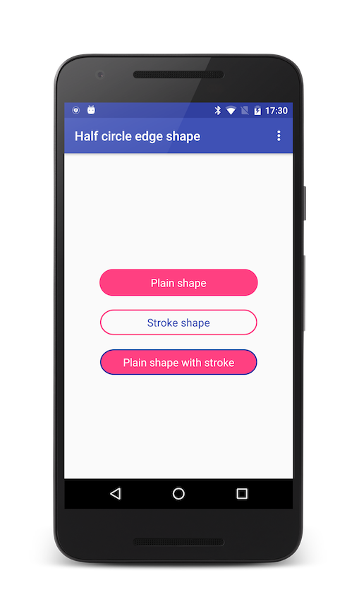
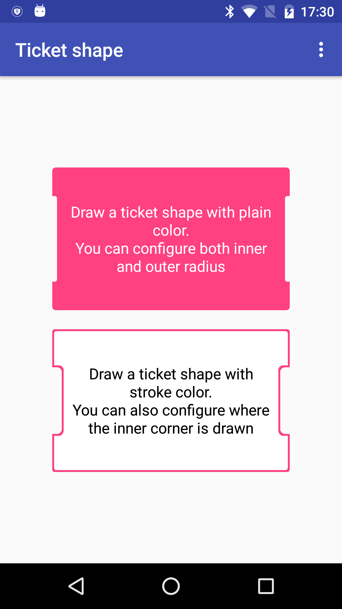

# ShapeView
[](https://jitpack.io/#StephenVinouze/ShapeView)
[](https://android-arsenal.com/api?level=1)
[](https://github.com/StephenVinouze/AdvancedRecyclerView/blob/master/LICENSE)

Drawing shapes can be achieved in many ways and depend mostly on how complex your shape is. This library intends to leverage how to draw basic shapes so that you need only focus on how to draw your shape using this toolbox.

Half circle edge shape | Ticket shape
---- | ---- | ----
 | 

## Gradle Dependency
Add this in your root `build.gradle` file:

```gradle
allprojects {
	repositories {
		// ... other repositories
		maven { url "https://jitpack.io" }
	}
}
```
Then add the dependencies that you need in your project.

```gradle
dependencies {
  compile 'com.github.StephenVinouze:ShapeView:1.0.0'
}
```

## Usage
An abstract *ShapeView* class allows you to configure two paths: one path is used to fill your content while the other can be used to draw a stroke around your shape. This class exposes three custom XML attributes:

* shapeColor: define which color will fill your shape
* shapeStrokeColor: define which color will be used for the stroke around your shape (if any)
* shapeStrokeWidth: define the width of your stroke (if any)

These attributes lets you define both in XML and programmatically your basic shapes. Starting from that, you can easily extend *ShapeView* to draw your own shapes by using the `Path` instance that the class provides.

Finally, *ShapeView* extends from *RelativeLayout* so you can easily put any view inside your shape.

## Examples

This library provides two shapes: a basic *HalfCircleEdgeShapeView* and a more complex *TicketShapeView*

### HalfCircleEdgeShapeView
This class extends from *ShapeView* and overrides both `onSizeChanged()` and `onDraw()` methods. The idea is to draw a shape with half circle at both left and right edges by using the `Path` instance. This shape can for instance be used as a *Button*.

```xml
<com.github.stephenvinouze.shapeview.shapes.HalfCircleEdgeShapeView
        android:layout_width="250dp"
        android:layout_height="wrap_content"
        android:layout_marginTop="20dp"
        android:padding="10dp"
        app:shapeColor="@color/colorAccent"
        app:shapeStrokeColor="@color/colorPrimaryDark"
        app:shapeStrokeWidth="2dp">
	
	<!-- Any subviews you want -->
	
</com.github.stephenvinouze.shapeview.shapes.HalfCircleEdgeShapeView>
```

### TicketShapeView
Similar to the previous shape, we define the shape using the `Path` instance to draw a ticket like shape. We provide a few custom XML attributes to define both `innerRadius` and `outerRadius` that will be applied to this shape. You can also specify where the inner radius will be applied.

```xml
<com.github.stephenvinouze.shapeview.shapes.TicketShapeView
        android:layout_width="250dp"
        android:layout_height="150dp"
        app:innerOffset="30dp"
        app:innerRadius="5dp"
        app:outerRadius="7dp"
        app:shapeColor="@color/colorAccent">
	
	<!-- Any subviews you want -->
	
</com.github.stephenvinouze.shapeview.shapes.TicketShapeView>
```

## License

```
Copyright 2016 Stephen Vinouze.

Licensed under the Apache License, Version 2.0 (the "License");
you may not use this file except in compliance with the License.
You may obtain a copy of the License at

   http://www.apache.org/licenses/LICENSE-2.0

Unless required by applicable law or agreed to in writing, software
distributed under the License is distributed on an "AS IS" BASIS,
WITHOUT WARRANTIES OR CONDITIONS OF ANY KIND, either express or implied.
See the License for the specific language governing permissions and
limitations under the License.
```
